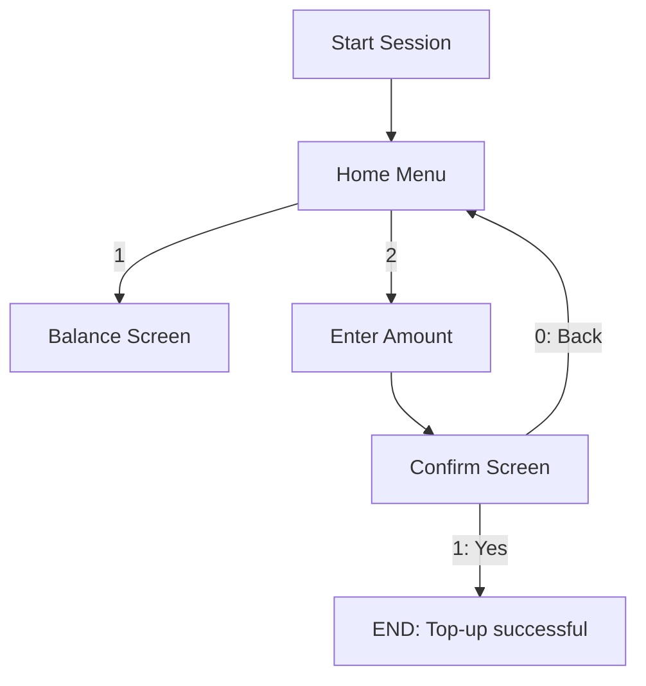
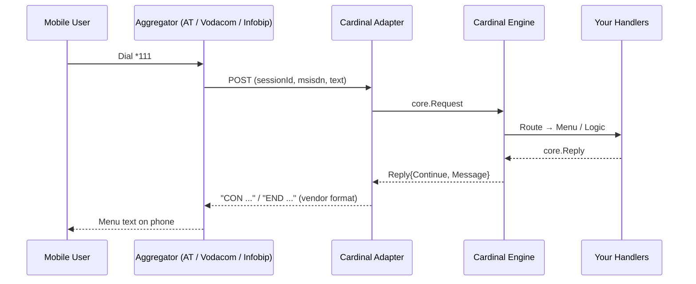

# Cardinal USSD Framework

*A minimal yet powerful Go framework for building USSD applications in Go.*

---

## 📞 What is USSD?

**USSD (Unstructured Supplementary Service Data)** powers interactive telco menus like:

* `*144#` → check airtime
* `*111#` → buy data bundles
* bank, fintech, and mobile money shortcodes

Its strength is **universality**: works on every mobile phone, without internet.
It remains the backbone of **financial inclusion, prepaid ecosystems, and mass-market services** across Africa, Asia, and beyond.

---

## ❓ Why Cardinal?

Building USSD services is deceptively complex:

* **Session management** → sessions are short (30–60s) and volatile.
* **Menu formatting** → every screen is text with numbered options.
* **Aggregator quirks** → different payloads (`sessionId`, `msisdn`, `text`).
* **Testing** → simulating multi-step conversations is non-trivial.

**Cardinal** gives developers a compass 🧭 for clarity:

* **Minimal Core** — `Request`, `Reply`, `Session`, `Engine`.
* **USSD-native semantics** — `SHOW` for screens, `INPUT` for choices.
* **Menu Builder** — auto-formats options, with `0) Back` and `00) Exit`.
* **Parametric Routes** — e.g. `/confirm/data/:id` via `c.Param("id")`.
* **Pluggable Stores** — in-memory for dev, Redis (planned) for prod.
* **Middleware Chain** — global, per-route, and group-level.
* **Router Groups** — prefix + shared middleware for subtrees.
* **Simulator Test Kit** — BDD-style flow testing.
* **Web Emulator** — try flows in your browser at `/emu`.

Cardinal is **small, predictable, composable** — you only build what you need.

---

## 🚀 Getting Started

### Install

```bash
go get github.com/grahms/cardinal
```

---


## 📋 Step-by-Step Examples

Let’s build a simple **airtime app** in stages, from a static menu to a parameterized confirmation flow.
Each example shows **code** and the **actual USSD output** (`CON` to continue, `END` to terminate).

---


### 1. Hello World Menu

**Code**

```go
r := router.New("/home")

r.SHOW("/home", func(c *router.Ctx) core.Reply {
    return menu.New("/home").
        Title("Welcome").
        Opt("Check Balance", "/balance").
        Opt("Buy Airtime", "/amount").
        Exit("Goodbye").
        Prompt(c)
})
r.INPUT("/home", func(c *router.Ctx) core.Reply {
    return menu.New("/home").
        Opt("Check Balance", "/balance").
        Opt("Buy Airtime", "/amount").
        Exit("Goodbye").
        Handle(c)
})
```

**User Flow**

```
CON Welcome
1) Check Balance
2) Buy Airtime
00) Goodbye
```

---

### 2. Balance Screen

**Code**

```go
r.SHOW("/balance", func(c *router.Ctx) core.Reply {
    return menu.New("/balance").
        Title("Balance: 123.45 MZN").
        Back("/home").
        Prompt(c)
})
r.INPUT("/balance", func(c *router.Ctx) core.Reply {
    return menu.New("/balance").Back("/home").Handle(c)
})
```

**User Flow**

```
CON Balance: 123.45 MZN
0) Back
```

---

### 3. Capturing Free-Form Input

**Code**

```go
r.SHOW("/amount", func(c *router.Ctx) core.Reply {
    return core.CON("Enter amount (MZN):")
})
r.INPUT("/amount", func(c *router.Ctx) core.Reply {
    in := c.In()
    if !digits(in) {
        return core.CON("Invalid amount. Try again:")
    }
    c.Set("amount", atoi(in))
    c.Redirect("/confirm/airtime")
    return core.CON("")
})
```

**User Flow**

```
CON Enter amount (MZN):
```

If user types `abc`:

```
CON Invalid amount. Try again:
```

---

### 4. Confirmation Screen

**Code**

```go
r.SHOW("/confirm/airtime", func(c *router.Ctx) core.Reply {
    amt, _ := c.Get("amount")
    return menu.New("/confirm/airtime").
        Title(fmt.Sprintf("Confirm %v MZN?", amt)).
        End("Yes", "Top-up successful.").
        Back("/home").
        Prompt(c)
})
r.INPUT("/confirm/airtime", func(c *router.Ctx) core.Reply {
    return menu.New("/confirm/airtime").
        End("Yes", "Top-up successful.").
        Back("/home").
        Handle(c)
})
```

**User Flow**

```
CON Confirm 100 MZN?
1) Yes
0) Back
```

If user selects `1`:

```
END Top-up successful.
```

---

### 5. Parameterized Sub-Paths

**Code**

```go
r.SHOW("/products/data", func(c *router.Ctx) core.Reply {
    return menu.New("/products/data").
        Title("Data Bundles").
        Opt("1GB / 100 MZN", "/confirm/data/1").
        Opt("2GB / 180 MZN", "/confirm/data/2").
        Back("/home").
        Prompt(c)
})
r.INPUT("/products/data", func(c *router.Ctx) core.Reply {
    return menu.New("/products/data").
        Opt("1GB / 100 MZN", "/confirm/data/1").
        Opt("2GB / 180 MZN", "/confirm/data/2").
        Back("/home").
        Handle(c)
})

r.SHOW("/confirm/data/:id", func(c *router.Ctx) core.Reply {
    return menu.New("/confirm/data/:id").
        Title("Confirm bundle " + c.Param("id") + "?").
        End("Yes", "Purchase complete").
        Back("/products/data").
        Prompt(c)
})
```

**User Flow**

```
CON Data Bundles
1) 1GB / 100 MZN
2) 2GB / 180 MZN
0) Back
```

Choosing `2`:

```
CON Confirm bundle 2?
1) Yes
0) Back
```

Then `1`:

```
END Purchase complete
```

---

📌 With just a few primitives (`SHOW`, `INPUT`, `Menu`, `Redirect`), you can model **complete telco flows** that are predictable, testable, and production-ready.


## 📑 Paginated Menus (Large Lists)

When your service offers **long catalogs** (data bundles, products, agents), it’s best to split them into pages.
Cardinal provides a **Paginator** helper to add `Prev`/`Next` options automatically.

### Example: Bundles Catalog

```go
bundles := []string{
    "Daily 100MB / 10 MZN",
    "Daily 500MB / 20 MZN",
    "Daily 1GB / 30 MZN",
    "Weekly 1GB / 50 MZN",
    "Weekly 2GB / 90 MZN",
    "Weekly 5GB / 200 MZN",
    "Monthly 1GB / 100 MZN",
    "Monthly 5GB / 400 MZN",
    "Monthly 10GB / 700 MZN",
    "Night 1GB / 15 MZN",
    "Night 3GB / 40 MZN",
    "Night 10GB / 100 MZN",
}

// Create paginator: 5 items per page
p := menu.NewPaginator("/bundles", bundles, 5).
    WithTitle("Pacotes de Dados").
    WithNavLabels("Anterior", "Seguinte").
    WithBack("/home")

// Paginated list routes
r.SHOW("/bundles/:page", func(c *router.Ctx) core.Reply {
    page, _ := strconv.Atoi(c.Param("page"))
    return p.Render(page).Prompt(c)
})
r.INPUT("/bundles/:page", func(c *router.Ctx) core.Reply {
    page, _ := strconv.Atoi(c.Param("page"))
    return p.Render(page).Handle(c)
})

// Confirm selected bundle
r.SHOW("/bundles/item/:idx", func(c *router.Ctx) core.Reply {
    idx, _ := strconv.Atoi(c.Param("idx"))
    chosen := bundles[idx]
    return menu.New("/bundles/item/:idx").
        Title("Confirmar\n" + chosen + "?").
        End("Sim", "Compra concluída.").
        Back("/bundles/1").
        Prompt(c)
})
```

### User Flow

**Page 1**

```
CON Pacotes de Dados
1) Daily 100MB / 10 MZN
2) Daily 500MB / 20 MZN
3) Daily 1GB / 30 MZN
4) Weekly 1GB / 50 MZN
5) Weekly 2GB / 90 MZN
6) Seguinte
0) Voltar
```

**Page 2**

```
CON Pacotes de Dados
1) Weekly 5GB / 200 MZN
2) Monthly 1GB / 100 MZN
3) Monthly 5GB / 400 MZN
4) Monthly 10GB / 700 MZN
5) Night 1GB / 15 MZN
6) Anterior
7) Seguinte
0) Voltar
```

**Confirmation**

```
CON Confirmar
Weekly 5GB / 200 MZN?
1) Sim
0) Voltar
```


## 🔗 Middleware

Middleware wraps handlers — like `net/http` but USSD-native.

```go
r.Use(
    middleware.Recover(),
    middleware.Logging(log.Default()),
    middleware.RateLimitPerMSISDN(5, 5*time.Second),
)
```

Per-route middleware:

```go
r.SHOWWith("/balance", balanceShow,
    middleware.HMAC("super-secret"),
    middleware.TightRouteLimit(),
)
```

Execution order: **globals → group(s) → route → handler**

---

## 🗂 Router Groups

Organize flows with a prefix and shared middlewares:

```go
secure := r.Group("/secure",
    middleware.HMAC("super-secret"),
    middleware.RateLimitPerMSISDN(5, 5*time.Second),
)

secure.SHOW("/balance", balanceShow)
secure.INPUT("/balance", balanceInput)

admin := secure.Group("/admin", middleware.Audit("admin"))
admin.SHOW("/dashboard", adminShow)
```

---

## 🖥 Emulator

Cardinal ships with a lightweight emulator for dev/test.

Mount it next to your engine:

```go
mux := http.NewServeMux()
mux.Handle("/ussd", transport.HTTPHandler(eng))
emulator.Attach(mux, eng) // /emu and /emu/send
```

Run your app:

```bash
go run ./examples/basic
```

Then open: [http://localhost:8080/emu](http://localhost:8080/emu)
You’ll see a phone-like screen to test sessions interactively.

---


## 🧪 Testing with Simulator

Building USSD flows without a way to **simulate conversations** is fragile.
Cardinal ships with a **test kit** (`testkit.Simulator`) that allows you to model an entire session step by step, in a style similar to BDD.

### Example: Airtime Top-Up Flow

```go
import (
    "testing"

    "github.com/grahms/cardinal/core"
    "github.com/grahms/cardinal/router"
    "github.com/grahms/cardinal/menu"
    "github.com/grahms/cardinal/store"
    "github.com/grahms/cardinal/testkit"
    "time"
)

func BuildEngineForTests() *core.Engine {
    r := router.New("/home")
    r.SHOW("/home", func(c *router.Ctx) core.Reply {
        return menu.New("/home").
            Title("Welcome").
            Opt("Buy Airtime", "/amount").
            Exit("Goodbye").
            Prompt(c)
    })
    r.INPUT("/home", func(c *router.Ctx) core.Reply {
        return menu.New("/home").
            Opt("Buy Airtime", "/amount").
            Exit("Goodbye").
            Handle(c)
    })
    r.SHOW("/amount", func(c *router.Ctx) core.Reply {
        return core.CON("Enter amount (MZN):")
    })
    r.INPUT("/amount", func(c *router.Ctx) core.Reply {
        if c.In() != "100" {
            return core.CON("Invalid. Try again:")
        }
        return core.END("Top-up successful.")
    })

    return core.New(r.Mount(), core.Config{Store: store.NewInMemoryStore(30 * time.Second)})
}

func TestTopupFlow(t *testing.T) {
    eng := BuildEngineForTests()
    sim := testkit.New(t, eng).Start("+258840000001")

    sim.Expect("Welcome").
        Send("1").         // Select Buy Airtime
        Expect("Enter amount").
        Send("100").       // Enter valid amount
        ExpectEndsWith("Top-up successful.")
}
```

### How It Works

* **`Start(msisdn)`** → begins a fresh simulated session for that phone number.
* **`Expect("...")`** → asserts that the current screen contains text.
* **`Send("...")`** → sends a user input as if typed on the phone.
* **`ExpectEndsWith("...")`** → ensures the reply ends the session with the expected text.

### Why It Matters

* Deterministic → catch regressions before deploying to a telco.
* Fast → no need for an aggregator sandbox during unit tests.
* Expressive → write your flows like scripts, easy for QA and devs alike.


---


## 🌍 Transport Channels (Aggregator Adapters)

Cardinal keeps its **core engine vendor-agnostic**, but telco aggregators each speak a different dialect.
Adapters in `transport/` normalize inbound requests to `core.Request` and format outbound replies as the aggregator expects.

```
[ Aggregator ] ⇄ [ Adapter ] ⇄ [ Engine ] ⇄ [ Router/Middleware/Menu ]
```

### Built-in Adapters

| Vendor / Adapter      | Inbound format                                                           | Outbound format                           | Endpoint (example) |
| --------------------- | ------------------------------------------------------------------------ | ----------------------------------------- | ------------------ |
| **Generic (default)** | form: `sessionId`, `phoneNumber`, `text`                                 | `CON ...` / `END ...` (plain text)        | `/ussd`            |
| **Africa’s Talking**  | form: `sessionId`, `phoneNumber`, `text`                                 | `CON ...` / `END ...` (plain text)        | `/ussd/at`         |
| **Vodacom (JSON)**    | JSON: `{sessionId, msisdn, userInput}`                                   | JSON: `{type:"Response", text:"CON ..."}` | `/ussd/voda`       |
| **Infobip (form)**    | form: `SESSION_ID`, `MSISDN`, `USSD_STRING` (fallbacks: `INPUT`, `text`) | `CON ...` / `END ...` (plain text)        | `/ussd/infobip`    |
| **Generic JSON**      | Configurable inbound/outbound keys                                       | Configurable JSON                         | `/ussd/json`       |

### Example Wiring

```go
mux := http.NewServeMux()

// Engine
eng := core.New(routes, core.Config{Store: store.NewInMemoryStore(60*time.Second)})

// Generic default (form)
mux.Handle("/ussd", transport.HTTPHandler(eng))

// Africa’s Talking (form)
mux.Handle("/ussd/at", transport.AfricaTalkingHandler(eng))

// Vodacom (JSON)
mux.Handle("/ussd/voda", transport.VodacomHandler(eng))

// Infobip (form)
mux.Handle("/ussd/infobip", transport.InfobipFormHandler(eng))

// Generic JSON (custom keys)
mux.Handle("/ussd/json", transport.JSONGenericHandler(
    eng,
    transport.JSONMap{InSessionID: "sid", InMsisdn: "from", InText: "input"},
    transport.JSONMap{OutTextKey: "message", OutWrapperKey: "type", OutWrapperVal: "Response"},
))
```

### curl Examples

**Africa’s Talking**

```bash
curl -X POST http://localhost:8080/ussd/at \
  -d 'sessionId=AT123' \
  -d 'phoneNumber=+258840000001' \
  -d 'text=1'
```

**Vodacom JSON**

```bash
curl -X POST http://localhost:8080/ussd/voda \
  -H 'Content-Type: application/json' \
  -d '{"sessionId":"VDC-123","msisdn":"+258840000001","userInput":"1"}'
```

**Infobip (form)**

```bash
curl -X POST http://localhost:8080/ussd/infobip \
  -d 'SESSION_ID=IB-987' \
  -d 'MSISDN=+258840000001' \
  -d 'USSD_STRING=00'
```

---

⚠️ **Note:** field names sometimes vary across tenants or regions.
All adapters accept override options (`ATFields`, `VodaFields`, `IBFields`, `JSONMap`) so you can adapt without touching the engine.



## 📜 Design Philosophy

* **Austere core** — no bloat, just USSD primitives.
* **USSD-native semantics** — `SHOW` / `INPUT` instead of HTTP verbs.
* **Composable** — build FSMs, REST-like routes, or simple switch/case.
* **Predictable** — consistent numbering, back/exit.
* **Testable** — simulate flows deterministically.

---

## ⚖️ License

MIT — free to use, fork, adapt.

